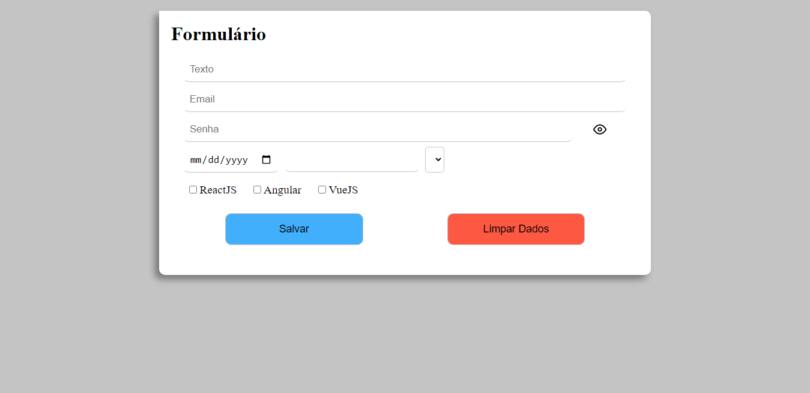
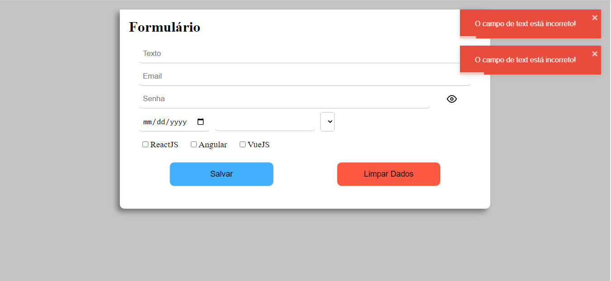
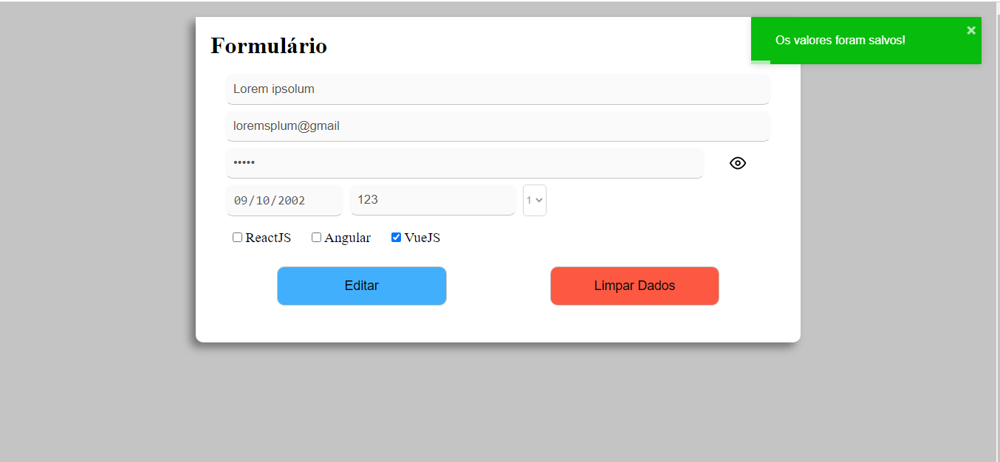

<h1 align="center">Desafio Supera Inovação em Tecnologia</h1>

## Oque se trata?

Trata-se de um formulário que valída os valores dos inputs e salva-os no storage no Browser.

## Tecnologias e bibliotecas utilizadas

- Angular
- Typescript
- Angular-toastly

## Requisitos minimos

- Ter o [nodejs](https://nodejs.org/en/){:target="\_blank"} instalado na sua maquina

## Como utilizar

- Faça o clone desse repositório
- Abra o projeto em algum editor de código de sua preferência
- No terminal do editor:
  - Execute o comando `npm install` para baixar todas as dependências do projeto
  - Logo após baixar as dependências, execute `npm start`
- O projeto irá abrir em http://localhost:4200/

## Screenshots

Se não houver nenhum dado armazenado no storage, os inputs iniciaram habilitados.

Se houver algum input com o valor inválido ao salvar, aparecerá uma notificação dizendo qual input está inválido.

Você pode pode também limpar os valores armazenados no storage, basta clicar em "Limpar dados" e aparecerá uma notificação de alerta.

Se todos os inputs estiverem valídos ao salvar, aparecerá uma notificação de sucesso.
